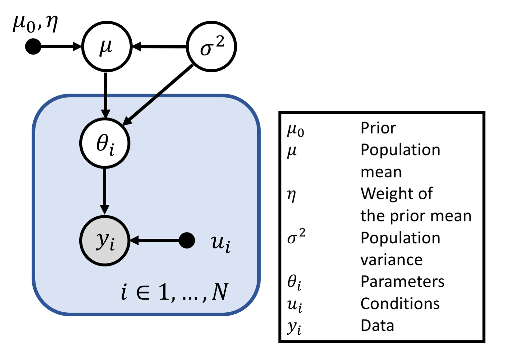

# H2GF: Hierarchical inference for the HGF
# Contents

- [Introduction](#introduction)
- [Quick start](#quick-start)
    * [An example script](#an-example-script)
        + [Setting up the model](#model)
        + [Settig up the data](#data)
        + [Setting up the inference](#inference)
- [Inputs and outputs](#inputs-and-outputs)
    * [Input](#input)
    * [Output](#output)
- [The model](#the-model)

# Introduction
The **h2gf** package is an extension of the HGF for hierarchical inference in
group studies. It provides a very simple method to pool information from 
a sample population to estimate the prior mean over subjects using 
hierarchical Bayes. In addition, it can be used to compute the model
evidence using thermodynamic integration.

# Quick start
From the matlab command line, write
```matlab
% Initialize tapas
tapas_init(); 
% Run an example script
posterior = tapas_h2gf_example();
```

## An example script
The h2gf package works out of the box with HGF models. The three main
inputs of the model are the data, an 'hgf' structure defining the
model, and a structure defining the configuration of the sampler. In
this section, we explain the sample script
`tapas/h2gf/tapas_h2gf_example.m`, whose contents we will go through
step by step.

### Model

The first part of the script sets up the model.
```matlab
% Initialize a structure to hold the hgf
hgf = struct('c_prc', [], 'c_obs', []);
% Set up the number of levels
hgf.c_prc.n_levels = 3; 

% Set up the perceptual function
hgf.c_prc.prc_fun = @tapas_hgf_binary;
% Set up the reparametrization function
hgf.c_prc.transp_prc_fun = @tapas_hgf_binary_transp;

% Set up the observation function.
hgf.c_obs.obs_fun = @tapas_unitsq_sgm; 
% Reparametrization function 
hgf.c_obs.transp_obs_fun = @tapas_unitsq_sgm_transp; 

% Enter the configuration of the binary hgf
config = tapas_hgf_binary_config();

% Priors of the perceptual model 
hgf.c_prc.priormus = config.priormus;
hgf.c_prc.priorsas = config.priorsas;

% Priors of the observational model
hgf.c_obs.priormus = 0.5;
hgf.c_obs.priorsas = 1;

% Set the empirical prior
% Eta weights the prior with respect to the observations. Because the prior
% mean mu is treated as fixed observations, eta is the number of observations
% represented by mu. If eta = 1, mu is treated as a single additional observation.
hgf.empirical_priors = struct('eta', []);
% eta can be a scalar of a vector. If eta is a vector, it should have
% the dimensionality of mu. 
hgf.empirical_priors.eta = 1;
```

### Data

Following the definition of the model, we enter the 'experimental' data. It 
is entered as the `data` structure array
with fields `y`, `u`, `ign`, and `irr`. `y` corresponds to subjects 
responses and `u` to experimental inputs. Each row in 'data' corresponds
to a different subject.
```matlab
%% Simulating data
% Number of subjects
num_subjects = 10;

% Values of ze, ka
ze = 0.5;
ka = 0.5;

% Used if data is simulated from fixed parameters
pars = [NaN 1 1 NaN 1 1 NaN 0 0 NaN ka NaN -4 log(0.0025)];
% Initialize a structure for the data
data = struct('y', cell(num_subjects, 1), ...
    'u', cell(num_subjects, 1), 'ign', [], 'irr', []);

% These are trials used in the experiment
[y, u] = tapas_h2gf_load_example_data();

for i = 1:num_subjects
	% Generate artifical data
    % sim = tapas_simModel(u, 'tapas_hgf_binary', ...
	%	pars, 'tapas_unitsq_sgm');

    % Instead of simulating data we use the same data 10 times. It is also
    % possible to generate data by uncommentic the lines above.

	% Fill the responses
    data(i).y = y;
	% and experimental manipulations
    data(i).u = u;
end
```

### Inference

At this point, we enter the parameters for the inference for the Markov 
Chain Monte Carlo algorithm that draws samples from the posterior
distribution of the model parameters. Default values are set in 
`tapas_h2gf_inference.m`.

```matlab
%% Parameters for inference
% Initialize the place holder for the parameters of the 
% inference. Missing parameters are filled by default
% values. This is implemented in tapas_h2gf_inference.m

inference = struct();
pars = struct();

% Number of samples stored 
pars.niter = 600;
% Number of samples in the burn-in phase
pars.nburnin = 600;
% Number of samples used for diagnostics. During the 
% burn-in phase the parameters of the algorithm are 
% adjusted to increase the efficiency. This happens after 
% every diagnostic cycle.
pars.ndiag = 200;

% Set up the so called temperature schedule. This is used to
% compute the model evidence. It is a matrix of NxM, where N 
% is the number of subjects and M is the number of chains used 
% to compute the model evidence. The
% temperature schedule is selected using a 5th order power rule. 
pars.T = ones(num_subjects, 1) * linspace(0.01, 1, 16).^5;

% This controls how often a 'swap' step is perform. 
pars.mc3it = 0;
```

The next line runs the algorithm using the input.

```matlab
%% Run the inference method
% This function is entry point to the algorithm. Note that its
% behavior can be largely modified by changing the default 
% settings.
hgf_est = tapas_h2gf_estimate(data, hgf, inference, pars);

display(hgf_est)
```

# Inputs and outputs
## Input

The inputs to `tapas_h2gf_estimate` are: `data`, `hgf`, `inference`, 
`parameters`. 

### data
`data` is a Nx1 structure array with the fields `y`, `u`, `ign`, `irr`. N is 
the number of observations or subjects.

| Field name | Type    | Meaning |
|------------|---------|---------|
| `y`          | Depends on the model. | Participants responses in N trials|
| `u`          | Depends on the model. | Experimental manipulation in N trial |
| `ign`        | Double array. | Ignored trials. |
| `irr`        | Double array. | Irregular trials. |

### hgf
`hgf` is a structure that defines the hgf model used for inference.
The fields are `c_prc` and `c_obs`.

| Field name | Type    | Example | Meaning |
|------------|---------|---------|---------|
| `c_prc`      | Structure | [1x1 struct] | Perceptual model.|
| `c_obs`      | Structure | [1x1 struct] | Observation model. | 

### infererence
`inference` is a structure containing the parameters of the inference
method. It should *always* be passed as an argument. The fields
not specified by the user are set in `tapas_h2gf_inference`. 

| Field name | Type    | Default | Meaning |
|------------|---------|---------|---------|
| `estimate_method` |  Function handle | `@tapas_mcmc_blocked_estimate` | Main method used for inference. |
| `initialize_state`  | Function handle | `@tapas_h2gf_init_state`  | Initializes the state of the sampler. |
| `initialize_states` | Function handle | `@tapas_h2gf_init_states` | Initialize the structure that contains the states of the sampler that are stored. |
| `sampling_methods` |  Cell array |  See `tapas_h2gf_inference` | An array of methods used to draw samples from the posterior distribution. Samples from each participants are drawn using Metropolis-Hastings with a Gaussian kernel as a proposal distribution and a Gibbs step is used for the second level parameters. |
| `metasampling_methods` | Cell array | See `tapas_h2gf_inference` | An array of methods for diagnosis and adaptive MCMC. By default the kernel of the Metropolis-Hastings is updated every certain number of iterations. |
| `get_stored_state` | Function Handle  |`@tapas_h2gf_get_stored_state` | Called to store (part) of the state of the sampler. |
| `prepare_posterior` | Function handle | `@tapas_h2gf_prepare_posterior` | Function handle | Called at the end of the simulation. It takes an array of stored states from the samples contain and prepares a user friendly output. For example, it computes the model evidence, the MAPs, etc.. |
| `mh_sampler` | Cell array | See `tapas_h2gf_inference` | Method used for the Metropolis-Step. |

### parameters
Structure with general parameters of the samplers. It can be an empty 
structure that will be automatically filled by `tapas_h2gf_pars`.

| Field name | Type    | Default | Meaning |
|------------|---------|---------|---------|
| `niter`      | Int scalar    | 4000    | Number of iterations of the model that are stored after burn-in. |
| `nburnin`    | Int scalar    | 1000    | Number of burn-in samples (not stored). |
| `seed`       | Int scalar    | 0       | Seed of the sampler. If 0, it use `rng('shuffle')` which uses the CPU clock to seed the RNG. Otherwise it uses `seed` as starting point RNG. |
| `ndiag`      | Int scalar    | 400     | Frequency of diagnostics. During the burnin phase, every `ndiag` samples the kernel of the samplers is updated. |
| `T`          | Double matrix |  | NxM Matrix with the temperature schedule, where N is the size of data, and M is the number of chains. The values should be between 0 and 1. |
| `nchains`    | Int scalar | 8 | Number of chains used. If this argument is provided and `T` is not, it will construct a temperature schedule with `nchains`. If `parameters` has the `T` field, `nchains` will be ignored and a warning will be generated. The temperature schedule is constructed as `linspace(0.01, 1, nchains)`. |
| `mc3it` | Int scalar | 0 | When using multi-chain this determines the frequency of 'swapping' proposal. This determines how many proposal are made per 'niter'. Note that this samples are not counted as part of the total number of samples. |
| `thinning` | Int scalar | 1 | Thinning factor. Only every `thinning` samples are stored. Thus the total number of samples will be `floor(niter/thinning).`


## Output
The output of the algorithm is `hgf_est`. This is a structure array with the
fields:

| Field name | Example | Meaning |
| ---------- | ------- | ------- |
| data       | [10x1 struct] | Input data |
| model      | [1x1 struct]  | Fully specified model. |
| inference  | [1x1 struct]  | Inference parameters. The seed of the random number generator is stored as rng_seed.|
| samples_theta | {10x200 cell} | NxM cell array with samples from the posterior, where N is the number of subjects and M is the number of samples. |
| fe        | -1152.5 | Log model evidence |
| llh       | {2x1 cell } | Samples of the log likelihood |
| accuracy  | -1127.1     | Estimated accuracy (expected log likelihood). |
| T         | [10x8 double] | Temperature schedule. |
| hgf       | [1x1 struct] | Input hgf model.  |
| summary   | [10x1 struct] | Nx1 summary structure of the parameter estimates. |

The field `hgf_est.summary` contains a summary of the posterior samples. It
is a Nx1 struct array, where N is the number of subjects. The fields are:

| Field name | Example | Meaning |
| ---------- | ------- | ------- |
| prc_mean  | [14x1 double] | Expected value of the perceptual parameters. |
| obs_mean  | 0.83 | Expected value of the observation parameters. |
| mean      | [14x1 double] | Expected value of all the parameters. |
| sequence  | [1x1 struct]  | States of the model computed from the values in mean. This should be compatible with the respective plotting functions.|
| covariance | [3x3 double] | Covariance of all estimated parameters. Observation model parameters are stacked *below* the perceptual parameters. |
| pseudo_lm2 | [-114.43]    | Pseudo model evidence for each subject. |
| r_hat     | [15x1 double] | R hat statistic or 'potential reduction factor' is a heuristic measure of MCMCM convergence. Values below 1.1 usually indicate convergence|

# The model

The main model used here is a 'Gamma-Gaussian' prior over the HGF 
parameters of each subject \(\theta_i\). It is assumed that the parameters
are Gaussian distributed around the population mean \(\mu\). The prior of 
the parameters \(\mu_0\) is effectively treated as a fixed number of 
observations. The weight of the observations is defined by \(\eta\).

# Contact 
aponteeduardo@gmail.com

copyright (c) 2018
