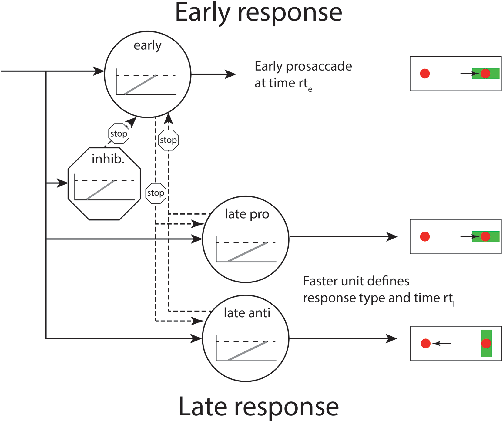
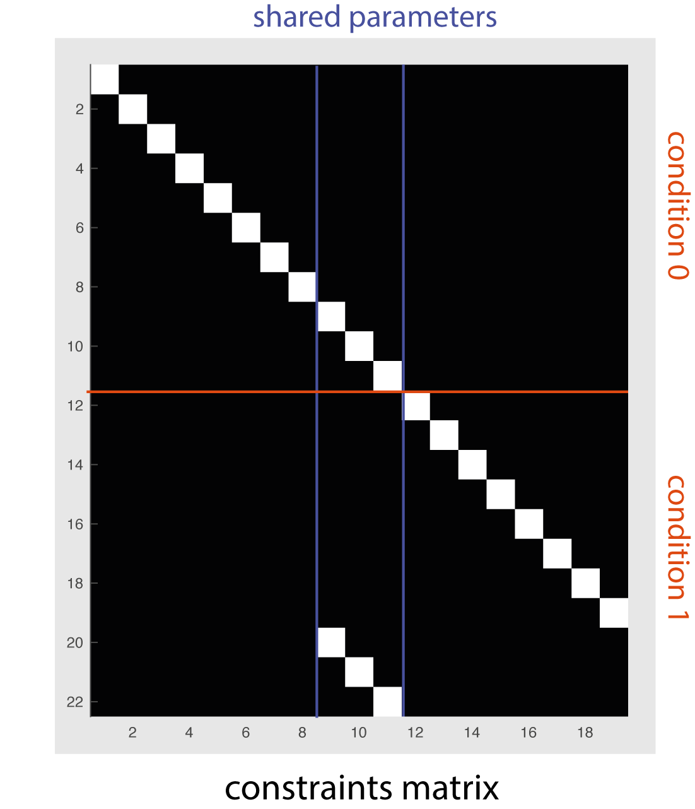
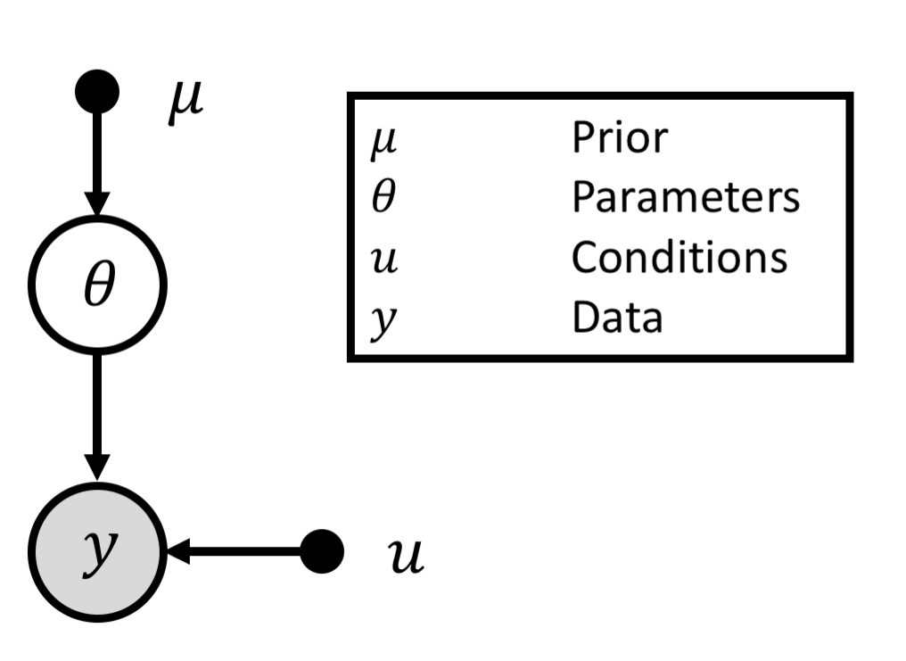
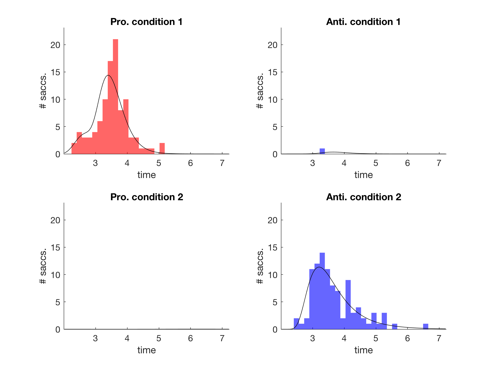
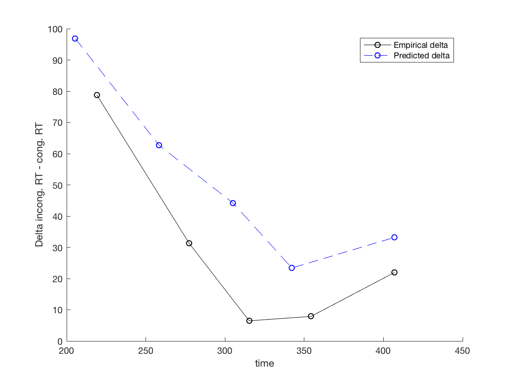
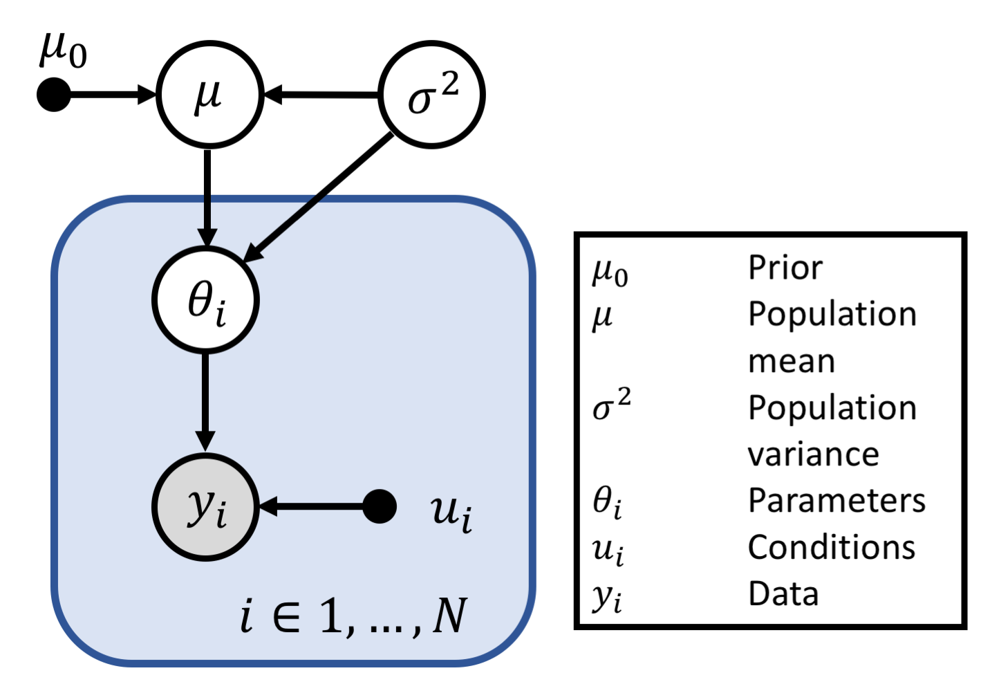
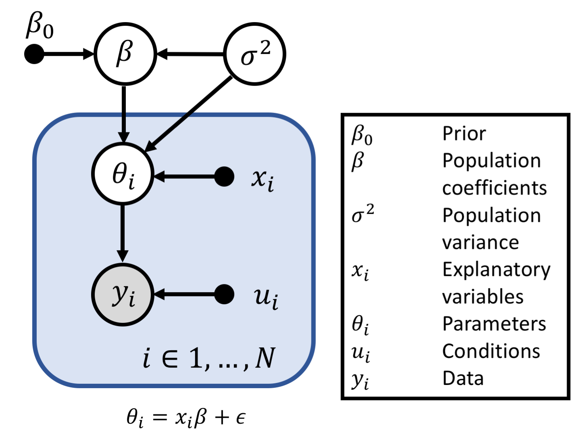
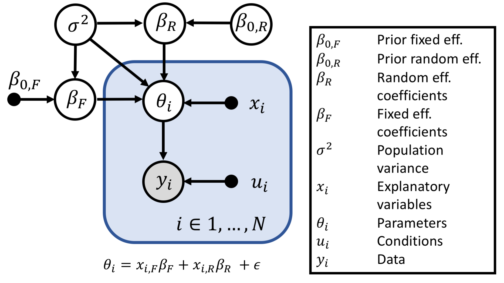

# Contents
- [The SERIA model](#the-seria-model)
    * [Quick start](#quick-start)
    * [The model](#the-model)
    * [Parametric distributions](#parametric-distributions)
    * [Parameter coding](#parameter-coding)
    * [The PROSA model](#the-prosa-model)
    * [Data coding](#data-coding)
    * [Constraints](#constraints)
    * [Model fitting](#model-fitting)
        + [Single subject](#single-subject-inference)
        + [Hierarchical](#hierarchical-inference)
        + [Parametric hierarchical](#parametrical-hierarchical-inference)
        + [Mixed effects](#parametric-mixed-effects)        
- [Installation](#installation)
    * [Matlab](#matlab-package)
    * [Python](#python-package)

# The SERIA model

## Quick start

We have a short video tutorial [here](https://youtu.be/XpTMrWBG_nw).

[SERIA](http://www.biorxiv.org/content/early/2017/06/08/109090)
is a formal statistical model of the probability of
pro- and antisaccades and the corresponding reaction times (RT). The SEM 
toolbox includes several methods of fitting SERIA based on the
[Metropolis-Hastings algorithm](https://en.wikipedia.org/wiki/Metropolis%E2%80%93Hastings_algorithm).
These methods are all implemented in MATLAB.

After installation (see below), from the MATLAB console, you can run an 
example using:

```matlab
tapas_init();
tapas_sem_flat_example_inversion();
```

This will load example data and estimate parameters. The data 
consist of a list of trials with trial type (pro- or antisaccade), the
action performed (pro- or antisaccade) and RT. 

The file `tapas/sem/examples/tapas_sem_example_estimate_single_subject.m`
can be used as a template for other analyses.

## The model


The SERIA model relies on the race-to-threshold framework to define the 
probability of an action and its RT. The main
assumption of SERIA is that actions and RT are determined by
4 accumulators or units with stochastic hit time. The units are

* the early prosaccade unit,
* the inhibitory unit (that can stop early prosaccades),
* the antisaccade unit,
* and the late prosaccade unit.

The first unit represents fast, reflexive prosaccades. This type of
saccades is triggered at time
\(t\) if the early unit hits threshold at time \(t\) and all the other 
units hit threshold at a later point. When the inhibitory unit hits threshold
before the early unit, early prosaccades are stopped. In
this case, the two late units (that represent voluntary, pro- and
antisaccades) can generate reactions depending on their hit times. 
If the antisaccade unit hits threshold at time \(t\) before the
late prosaccade unit, an antisaccade at time \(t\) is generated, and
similarly so for prosaccades.

This idea is represented in the figure on the right, where the four units and
their interactions are displayed.

In addition to the units, we assume that there is an overall delay or 
non-decision-time that affects all the units. Saccades with a latency below
the no-decision-time are still possible but are considered outliers. 
Finally, the late units 
are assumed to be delayed with respect to the early and inhibitory units.
This delay can be understood as the cost of voluntary saccades.

A more detailed explanation can be found in [here](https://journals.plos.org/ploscompbiol/article?id=10.1371/journal.pcbi.1005692).

## Parametric distributions 
Different parametric distributions can be used to model 
the hit time of the SERIA units. The distributions used
here are defined by two parameters, which correspond (roughly)
to the mean hit time of the units and their variance. 

Below is the table of all the options implemented in the toolbox, 
including the name, the distribution of the early and late units, 
and the name of the
function that implements each of the models (i.e., the likelihood 
function). We recommend the inverse Gamma distribution,
or a combination of the Gamma and inverse Gamma functions (mixed 
Gamma model).

| Name | Early & inhibitory unit | Late units | Likelihood function |
|:-----:|:-----:|:-----:|:-----:|
| Gamma | Gamma | Gamma | `c_seria_multi_gamma` |
| Inv. Gamma | Inv. Gamma | Inv. Gamma | `c_seria_multi_invgamma` |
| Mixed Gamma | Inv. Gamma | Gamma | `c_seria_multi_mixedgamma` |
| Log. Normal | Log. Normal | Log. Normal | `c_seria_multi_lognorm` |
| Wald | Wald | Wald | `c_seria_multi_wald` |
| Later | Later | Later | `c_seria_multi_later` |

The [Wald distribution](https://en.wikipedia.org/wiki/Inverse_Gaussian_distribution)
is the hit time distribution of a drift-diffusion process with a single
boundary. The [Later distribution](https://doi.org/10.1016/j.neubiorev.2016.02.018) 
models the random variable \(1/X\),
where \(X\) is truncated normal distributed and \(X>0\).

## Parameter coding
The parameters of SERIA are organized as a 11x1 vector. The table below
explains the meaning of each parameter.

|\# | Meaning |
|:----:|-------|
|1 | log mean hit time early unit|
|2 | log variance hit time early unit|
|3 | log mean hit time anti. unit|
|4 | log variance hit time anti. unit|
|5 | log mean hit time inhib. unit|
|6 | log variance hit time inhib. unit|
|7 | log mean hit time late pro. unit|
|8 | log variance hit time late pro. unit|
|9 | log no decision time|
|10 | log late units delay |
|11 | logit of 1 minus the probability of an early outlier|

All the parameters are in a scale from \(-\infty\) to \(\infty\). The
appropriate transformations are implemented internally depending on the
parametric distribution used for the hit time of the units.

### The PROSA model 
In PROSA, prosaccades can only be generated by the early unit.
Because PROSA lacks late prosaccades, it has 2 parameters less
than the SERIA model (parameters 7 and 8). The same set of parametric 
distributions are implemented for the SERIA and PROSA models according
to the table below.

| Name | Early & inhibitory unit | Late units | Likelihood function |
|:-----:|:-----:|:-----:|:-----:|
| Gamma | Gamma | Gamma | `c_prosa_multi_gamma` |
| Inv. Gamma | Inv. Gamma | Inv. Gamma | `c_prosa_multi_invgamma` |
| Mixed Gamma | Inv. Gamma | Gamma | `c_prosa_multi_mixedgamma` |
| Log. Normal | Log. Normal | Log. Normal | `c_prosa_multi_lognorm` |
| Wald | Wald | Wald | `c_prosa_multi_wald` |
| Later | Later | Later | `c_prosa_multi_later` |

## Data coding
The data entered into the model is encoded as a structure with fields
`y` and `u`, in which the number of rows corresponds to the number of 
subjects.
 
The field `y` represents RT (in tenths of a second) and the corresponding 
action. The contents of each field are represented by vectors of Nx1 trials.

| Fields of `y` | Meaning | Data |
|:----------:|:-------:|:----:|
| `t`        | Reaction time | Tenths of a second |
| `a`        | Action        | Pro=0, Anti=1 |

The field `u` represents experimental conditions and it has a single 
subfield `tt`, which is a vector of Nx1 trials. `u.tt` codes the condition
of the corresponding trial. Conditions should be coded
by integers starting at 0. 

| Fields `u` | Meaning | Data |
|:----------:|:-------:|:----:|
|`tt`       | Trial type <br> (condition) | Integer from 0 to M |

For example, if in an experiment pro- and antisaccade trials are mixed in
a single block, it is possible to code these two types of trials as 0 and 1.
A complete set of parameters (11x1 vector) is initialized for each condition.
The two sets of parameters are then stacked in a single vector of dimensionality
22x1. 

In the example below, there are 4 trials (two pro., two anti.), from two
different conditions.
```matlab

y = struct('t', [], 'a', []);
% Four trials with latencies 200ms, 400ms, 500ms, 300ms
y.t = [0.2, 0.4, 0.5, 0.3]';
% The first two trials are prosaccades, the last two are antisaccades
y.a = [0, 0, 1, 1]';

u = struct('tt', []);
% First two trials are from condition 0 and two last from condition 1.
u.tt = [0 0 1 1]';

% The input data is composed of fields y and u
data = stuct('y', [], 'u')
```

## Constraints
It is possible to enforce constraints on the model parameters 
across conditions using a *projection matrix*. 
This matrix, *J*, should have *M* times 11 rows and *K* columns, 
where *M* is the number of conditions and *K* is the number of free 
parameters.

For example, we want to enforce that the *no decision time*, 
*the probability of an early outlier* and *the delay of the late unit*
are shared across two conditions. These parameters are the 9th to 11th entries
on the parameter vector. Because different conditions are stacked into
a single vector, we need a matrix that enforces that
the entries 9 to 11 are equal to the entries 20 to 22. Note that this implies
that the model has effectively 19, and not 22 parameters. This can be 
accomplished as shown below.



```matlab
K>>J = [eye(19);
    zeros(3, 8) eye(3) zeros(3, 8)]; 
K>>v = [1:19]';
K>>display((J * v)');
ans =

  Columns 1 through 12

     1     2     3     4     5     6     7     8     9    10    11    12

  Columns 13 through 22

    13    14    15    16    17    18    19     9    10    11
```
When multiplying the vector *v* and matrix *J*, we force the
last 3 entries to be equal to the 9th to 11th entries. This 
provides a method to code constraints in the parameter space.
Note that the number of conditions encoded in `u.tt` should be the same
as the number of conditions \(M\). 

## Model fitting 
The toolbox includes a variety of methods to fit models to experimental
data based on the Metropolis-Hastings algorithm. This is a generic method
to sample from a target distribution (usually the distribution of the 
model parameters conditioned on experimental data). The results are
an array of samples from the target distribution, which can be used to 
compute summary statistics (mean, variance) of parameters estimates.

There are currently four methods to fit models:

| Name | Multiple/single subject | Description | Function |
|:----:|:-------------------:|-------------|----------|
|Single subject  | Single subject     | Fits a single subject. | `tapas_sem_single_subject_estimate.m` |
|Hier.    | Multi. subject    | Uses the population mean as prior of the parameters. | `tapas_sem_hier_estimate.m` |
|Multiv.  | Multi. subject  | Uses a linear model to construct a parametric prior from the population. | `tapas_sem_multiv_estimate.m` |
|Mixed    | Multi. subject  | Uses a mixed effects model to construct a parametric prior from the population. | `tapas_sem_mixed_estimate.m` |

These methods are explained in some detail below.

### Single subject inference 


In the most simple case, the data from a subject is fitted using a standard
prior. Several conditions can be coded in `data.u.tt` and constraints 
across conditions can be implemented using a projection matrix as explained
above.

On the left, the Bayesian network that represents the 
model is displayed. The responses \(y\) are fitted using parameters \(\theta\), whose
prior is encoded by \(\mu\). Note that \(u\) encodes the subject specific 
conditions.

An example can be found in 
`tapas/sem/examples/tapas_sem_example_single_subject_estimate.m`. Below, we have
commented an abbreviated version of the example.

#### Example
```matlab
% This function loads the data and prepares it into the right format.
% The data contains two conditions (pro- and antisaccade trials)
[data] = prepare_data();

% Initilize the parameters and prior of the model.
ptheta = tapas_sem_seria_ptheta(); 

% Select the likelihood function
ptheta.llh = @c_seria_multi_mixedgamma;

% Default values for the Metropolis-Hastings algorithm 
htheta = tapas_sem_seria_htheta();

% Constraints for the inversion. As in the example above, we enforce the
% constraint that parameters 9 to 11 are equal across the two conditions
ptheta.jm = [...
    eye(19)
    zeros(3, 8) eye(3) zeros(3, 8)];

pars = struct();

% This implements a multi-chain approach. It can be used to compute the
% model evidence and improve the efficiency of the algorithm. If only
% the posterior is desired use pars.T = 1;
nchains = 16;
pars.T = linspace(0.1, 1, nchains).^5;
% Number of burn-in samples
pars.nburnin = 4000;
% Number of kept samples
pars.niter = 4000;
% Number of samples between diagnostics
pars.ndiag = 1000;
% Number of times that a swap between chains is performed
pars.mc3it = 16;
% Verbosity of the diagnostics
pars.verbose = 1;

display(ptheta);
tic
% Estimate the model.
posterior = tapas_sem_single_subject_estimate(data, ptheta, htheta, pars);
toc
tapas_sem_display_posterior(posterior)
posterior
``` 
The command `tapas_sem_display_posterior` plots the histogram of the RT 
and the fits. Each row represents one of the conditions. The left column
represents prosaccades, and the right column antisaccades. In the example,
prosaccade trials are coded with 0, and antisaccade trials with 1.
  


In addition, delta plots of all conditions are generated.
[Delta plots](https://www.ncbi.nlm.nih.gov/pubmed/15869351) display the 
difference in mean RT between antisaccades (incongruent trials) and 
prosaccades (congruent trials) for different quantiles. Conceptually, these
plots represent the time course of the antisaccade cost. They are mostly
used in the context of the Simon task, which can also be analysed using the
SERIA model. Not only the empirical delta plots are displayed, but also the
predicted delta plots according to the respective model.



The variable `ptheta` represents the parameters of the model. It is a 
structure with several fields explained in the table below.

| Field | Example value | Explanation |
|:-----:|:-------------:|-------------|
|mu|[11x1 double]| Prior mean of the parameters. |
|pm|[11x1 double]| Prior precision (inverse variance) of the parameters |
|p0|[11x1 double]| Expansion point (initialisation) of the algorithm |
|bdist|11| Not used |
|jm|[22x19 double]| Constraint matrix. |
|name|'seria'| Name of the model |
|llh|@c_seria_multi_mixedgamma| Likelihood function |
|lpp|@tapas_sem_prosa_lpp| Prior density function. Shared between the PROSA and SERIA models |
|prepare|@tapas_sem_prepare_gaussian_ptheta| Initialisation function of the parameters.|
|sample_priors|@tapas_sem_sample_gaussian_uniform_priors| Methods to sample the parameters  |
|ndims|11| Number of parameters (11 for SERIA, 9 for PROSA) |

The results from the model are

| Field | Example value | Explanation |
|:-----:|:-------------:|-------------|
|pE|[22x1 double]| Expected value of the parameters |
|pP|[22x1 double]| Variance of the parameters |
|map|[22x1 double]| Maximum a posteriori from the samples|
|ps_theta|[22x4000| Samples from the posterior distribution|
|fe|-799.6920| Log model evidence estimate|
|data|[1x1 struct]| Data input|
|ptheta|[1x1 struct]| Input parameters (see above)|
|htheta|[1x1 struct]| Input parameters (see above)|
|pars|[1x1 struct]| Input parameters (see above)|

In addition, `tapas_sem_display_posterior` generates a table with some
summary statistics computed by the model.


The columns of the table are

| Column | Example value | Explanation |
|:-----:|:-------------:|-------------|
| Subject | 1           | Index of the subject in the data struct |
| Condition | 1         | |
| late_pro_prob | 0.79 | Probability of a late prosaccade. This is the probability that the late prosaccade unit hits threshold before the antisaccade unit.|
| inhib_fail_prob | 0.62 | Probability of an inhibition failure. This is the probability that the early unit hits threshold before all other units |
| late_pro_rt | 3.67 | Mean RT of late prosaccades. The scale is tenths of a second.|
| anti_rt | 3.35 | Mean RT of the antisaccade unit.| 
| inhib_fail_rt | 1.95 | Mean RT of inhibition failures.|
| predicted_pro_rt | 2.49 | Predicted prosaccade RT. This should be similar to the empirical value |
| predicted_pro_prob | 0.91 | Predicted prosaccade probability. |
| predicted_anti_rt | 3.28 | Predicted antisaccade RT. |
| predicted_anti_prob | 3.28 | Predicted antisaccade probability. |

The predicted values are the expected RT and error rate based on the 
parameter estimates. Other values are predictions of the model
that are not directly observable. These statistics are explained in more
details [here](https://doi.org/10.1152/jn.00240.2018).

### Hierarchical inference 


SEM offers the option to use a hierarchical model to pool information 
across subjects. This method treats the mean of the parameters across
subjects as a latent variable, which is also estimated. It offers a form 
of regularization based on observations from the population.

The graphical representation of this model is displayed on the right. Note 
that now data from \(i=1,...,N\) subjects is fitted simultaneously. 
The population mean is represented by the latent variable \(\mu\) which is 
inferred from the parameters \(\theta_i\). In addition, the variance of the
population \(\sigma^2\) is also estimated.

Data from different subjects should be entered as rows in 
the `data` structure array.

#### Example
This example is adapted from the file 
`tapas/sem/examples/tapas_sem_example_hier_estimate.m`

```matlab
[data] = prepare_data();

ptheta = tapas_sem_seria_ptheta(); 
ptheta.llh = @c_seria_multi_invgamma;
ptheta.jm = [...
    eye(19)
    zeros(3, 8) eye(3) zeros(3, 8)];

pars = struct();

% The temperature array used for multichain should have be NxM where
% N is the number of subjects and M the number of chains. 
pars.T = ones(4, 1) * linspace(0.1, 1, 8).^5;
pars.nburnin = 4000;
pars.niter = 4000;
pars.ndiag = 1000;
pars.mc3it = 16;
pars.verbose = 1;

display(ptheta);
inference = struct();
tic
posterior = tapas_sem_hier_estimate(data, ptheta, inference, pars);
toc

display(posterior);
```
The example data is a structure array of dimensions 4x1.

```matlab
K>> display(data)

data =

  4x1 struct array with fields:

    y
    u

```

The output of `tapas_sem_hier_estimate` has the fields:

| Field | Example value | Explanation |
|:-----:|:-------------:|-------------|
|data|[4x1 struct]|Input data|
|model|[1x1 struct]|Input model|
|inference|[1x1 struct]|Input inference|
|samples_theta|{4000x1 cell}|Samples of the parameters.|
|fe|-770.9473| log model evidence|
|llh|{2x1 cell}| samples of the log likelihood|
|T|[4x8 double]| Temperature array used|

### Parametric hierarchical inference


While the previous method pools information across
subjects, it cannot model the effect of any experimental manipulation. 
With parametric hierarchical inference, a linear model defines the prior 
distribution of each subject.

The graphical model on the right extends the previous model by defining a
parametric empirical prior for each subject, based on independent 
variables \(x_i\). 

Developing the example above, we can assume that subjects 1 and 2 received
treatment A, and subjects 3 and 4 received treatment B. This design can be
entered using 'effects' coding:

```matlab
X =

     1     1
     1     1
     1    -1
     1    -1
```
Note that the first column of `X` represents the population mean or 
intercept, and the second column represent the contrast of treatment A and B.

#### Example
This example is adapted from 
`tapas/sem/examples/tapas_sem_example_multiv_estimate.m`.

```matlab
[data] = prepare_data();

ptheta = tapas_sem_seria_ptheta(); 

ptheta.jm = [...
    eye(19)
    zeros(3, 8) eye(3) zeros(3, 8)];

% In addition to the constraint matrix, the design matrix is entered as
% a field of the model especified in ptheta
ptheta.x = [1 1; 1 1; 1 -1; 1 -1];

pars = struct();
pars.T = ones(4, 1) * linspace(0.1, 1, 8).^5;
pars.nburnin = 4000;
pars.niter = 4000;
pars.ndiag = 1000;
pars.mc3it = 16;
pars.verbose = 1;

display(ptheta);
inference = struct();
tic
posterior = tapas_sem_multiv_estimate(data, ptheta, inference, pars);
toc

display(posterior);

```

`tapas_sem_multiv_estimate` returns a similar structure as 
`tapas_sem_hier_estimate`.

### Parametric mixed effects 


The parametric prior above can be extended into a mixed effects model.
This type of models contains some coefficients
\(B_R\) whose prior mean \(B_{0,R}\) is treated as a latent variable. 
In other words, the mean of the coefficients \(B_R\) is itself a parameter
that is estimated from the model.
On the right, the graphical representation of the mixed effects model is 
displayed. 

As an example application, assume that 3 subjects participated in an 
experiment with 2 conditions (A and B). Condition A was measured in the
first two sessions. Condition B was measured in the last two sessions
 (3 and 4). To account for the fact that 
several observations originate from the same subject, it is possible to 
define a subject specific regressor. In the example below, these 
regressors are specified in the columns 2 to 4. The first column models 
conditions A and B.

```matlab
X =

     1     1     0     0 % Condition A
     1     1     0     0 % Condition A
    -1     1     0     0 % Condition B
    -1     1     0     0 % Condition B
     1     0     1     0
     1     0     1     0
    -1     0     1     0
    -1     0     1     0
     1     0     0     1
     1     0     0     1
    -1     0     0     1
    -1     0     0     1
```
Note that no population mean (or overall intercept) is 
included. In this case, the population mean is the mean of the subject 
specific intercept.
To do this, we group regressors 2 to 4 in the variable `ptheta.mixed`
```matlab
ptheta.mixed = [0 1 1 1];
```
These groups regressors 2 to 4 and generates the random effect 
population mean \(B0,R\). Currently, it is only possible to model only one
random effect.

#### Example
This example is adapted from 
`tapas/sem/examples/tapas_sem_example_mixed_estimate.m` and is almost
identical to the examples from the sections above. In the example data, 
there are 4 observations from 4 subjects. We use a single regressor for
each subject in the line `ptheta.x = eye(4)`,
and group the four regressors with `ptheta.mixed = [1 1 1 1];`.

```matlab
[data] = prepare_data();

ptheta = tapas_sem_seria_ptheta(); 
ptheta.llh = @c_seria_multi_invgamma;

ptheta.jm = [...
    eye(19)
    zeros(3, 8) eye(3) zeros(3, 8)];

ptheta.x = eye(4);
ptheta.mixed = [1 1 1 1];
pars = struct();

pars.T = ones(4, 1) * linspace(0.1, 1, 8).^5;
pars.nburnin = 4000;
pars.niter = 4000;
pars.ndiag = 1000;
pars.mc3it = 16;
pars.verbose = 1;

display(ptheta);
inference = struct();
tic
posterior = tapas_sem_mixed_estimate(data, ptheta, inference, pars);
toc

display(posterior);

```
The output structure has the same fields as 'tapas_sem_hier_estimate'.

## Parameter interpretation
The parameters returned by the model are mostly in log scale and represent
the mean and variance of the hit time of the units. However, several points
are noteworthy.

The hit time of the early and inhibitory unit is shifted by the overall 
delay of all units (parameter 9). The hit time of the late units
is shifted by the overall delay and the delay of the late units (parameter 9
and 10).

It is possible to transform the unit parameters
to more standard parametrizations. For example, the
[Gamma distribution](https://en.wikipedia.org/wiki/Gamma_distribution)
is usually represented by a shape and a scale parameter. To transform
posterior samples to these parametrizations use the functions in the table 
below. Note that
the input should be a cell array of vectors of 11xM rows and 1 column
(SERIA), or 9xM rows and 1 column (PROSA).

|Parametric  | SERIA  | PROSA  |
|------------|----------------|----------------|
|Gamma       |`c_seria_reparametrize_gamma`|`c_prosa_reparametrize_gamma`|
|Inv. Gamma  |`c_seria_reparametrize_invgamma`|`c_prosa_reparametrize_invgamma`|
|Mixed Gamma |`c_seria_reparametrize_mixedgamma`|`c_prosa_reparametrize_mixedgamma`|
|Log Norm.   |`c_seria_reparametrize_lognorm`|`c_prosa_reparametrize_lognorm`|
|Later       |`c_seria_reparametrize_later`|`c_prosa_reparametrize_later`|
|Wald        |`c_seria_reparametrize_wald`|`c_prosa_reparametrize_wald`|

The parametrizations of the distributions are given in the following equations.

### Gamma distribution
Shape-scale parametrization:
\(p(t|a, b) = \frac{1}{\Gamma(a) b^a} t^{a-1} \exp (-t/b). \)
### Inverse Gamma
Shape-scale parametrization:
\(p(t| a, b) = \frac{b^a}{\Gamma(a) t^{-a - 1}} \exp \left( -\frac{b}{t}\right). \)
### Lognormal
The parametrization is the \(\mu,\sigma^2\):
\(p(t|\mu,\sigma^2) = \frac{1}{t\sigma \sqrt{2\pi}} \exp \left(- (\ln t - \mu)^2 / 2\sigma^2 \right). \)
### Later
In the later model, the representation used by SERIA is not the mean
and variance, but the \(\mu\) and \(\sigma^2\) parameterization:
\(p(t| \mu, \sigma^2) = \frac{1}{\phi(t/\sigma)} \exp \left(- \frac{(x-\mu)^2}{2 \sigma^2} \right), \)
\( \phi(x) = \int_0^x \exp(- \tau^2/2 ) d\tau. \)
### Wald
The parametrization is the \(\lambda,\mu\) representation:
\(p(t|\mu,\lambda) = \sqrt{\frac{\lambda}{2\pi t^3}} \exp \left( \lambda (t - \mu)^3/(2t\mu^2) \right). \)

# Installation
SEM contains matlab, python, and c code. The c code uses efficient 
numerical techniques to accelerate the inversion of the model. It requires
the installation of the numerical library
[gsl](https://www.gnu.org/software/gsl/) in the version 1.16 or above.

The main part of the package is implemented in matlab. We have tested the
compilation in different flavors of ubuntu, centOS and MacOS using 
autotools (see below).

## Supported platforms

Mac OSX and linux are supported. We have tested in a variety of setups
and it has worked so far. If you have any issue please contact us.

We do not support Windows but most likely it can be installed as a python 
package.

## Dependencies

* gsl/1.16>

In Ubuntu, it can be install as 
~~~~
sudo apt-get install libgsl0-dev
~~~~
To install in Mac
~~~~
brew install gsl
brew install clang-omp 
~~~~
Or alternatively using mac ports.
~~~~
sudo port install gsl
~~~~

## Matlab package

You will need a running matlab 
installation. In particular, the command line command  `matlab` should be able
to trigger matlab. The reason is that matlab is used to find out the 
matlabroot directory during the configuration. Make sure
that matlab can be triggered from the command line AND that it is not an
alias.

### Linux
To install the package it should be enough to go to
~~~~
cd tapas/sem/src/
~~~~
and type
~~~~
./configure && make
~~~~
The most likely problems you could face are the following:

#### Something with automake or aclocal.
In that case please install automake,f.e.,
~~~~
sudo apt-get install automake
~~~~
Then type
~~~~
autoreconf -ifv
~~~~
Then try again
~~~~
./configure && make
~~~~

### Mac

This follows the same process than linux.

Most likely config will fail for one of the following reasons.

#### Has config found gsl's header? 

Often after installation, the compiler fails to find gsl's headers.
~~~~
export C_INCLUDE_PATH="$C_INCLUDE_PATH:/opt/local/include"
export CFLAGS="-I:/opt/local/include $CFLAGS"
./configure && make
~~~~

#### Has config found gsl's libraries? 

If not type
~~~~
export LDFLAGS="$LDFLAGS -L/opt/local/lib/ -L/usr/local/lib"
configure && make
~~~~
#### Has config found matlab?
If not, find the path of matlab and type
~~~~
export PATH=$PATH:your-matlab-path
./configure && make
~~~~

To find the matlabroot directory, in the matlab console type
~~~~
matlabroot
~~~~

## Python package 

This toolbox can be installed as a python package. Although no inference
algorithm is currently implemented, it can be used in combination
with packages implementing maximum likelihood estimation or the 
Metropolis-Hasting algorithm. After installation, it can be imported as
~~~~
from tapas.sem.antisaccades import likelihoods as seria
~~~~
This contains all the models described in the original
[SERIA paper](https://doi.org/10.1371/journal.pcbi.1005692).

### Python installation

This toolbox can be install as a python package using
~~~~
sudo python setup.py install 
~~~~
If you lack sudo rights or prefer not install it this way use
~~~~
python setup.py install --user
~~~~
Requirements can be installed using
~~~~
pip install -r requirements.txt
~~~~

aponteeduardo@gmail.com
copyright (C) 2015-2019

